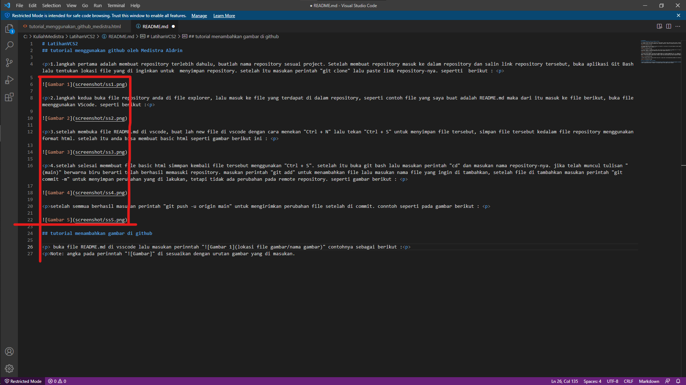

# LatihanVCS2
## tutorial menggunakan github oleh Medistra Aldrin

1.langkah pertama adalah membuat repository terlebih dahulu, buatlah nama repository sesuai project. Setelah membuat repository masuk ke dalam repository dan salin link repository tersebut, buka aplikasi Git Bash lalu tentukan lokasi file yang di inginkan untuk  menyimpan repository. setelah itu masukan perintah "git clone" lalu paste link repository-nya. sepertti  berikut : 

2.langkah kedua buka file repository anda di file explorer, lalu masuk ke file yang terdapat di dalam repository, seperti contoh file yang saya buat adalah README.md maka dari itu masuk ke file berikut, buka file meenggunakan VScode. seperti berikut :

3.setelah membuka file README.md di vscode, buat lah new file di vscode dengan cara menekan "Ctrl + N" lalu tekan "Ctrl + S" untuk menyimpan file tersebut, simpan file tersebut kedalam file repository menggunakan format html. setelah itu anda bisa membuat basic html seperti gambar berikut ini : 

4.setelah selesai memmbuat file basic html simmpan kembali file tersebut menggunakan "Ctrl + S". setelah itu buka git bash lalu masukan perintah "cd" dan masukan nama repository-nya. jika telah muncul tulisan "(main)" berwarna biru berarti telah berhasil memasuki repository. masukan perintah "git add" untuk menambahkan file lalu masukan nama file yang ingin di tambahkan, setelah file di tambahkan masukan perintah "git commit -m" untuk menyimpan perubahan yang di lakukan, tetapi tidak ada perubahan pada remote repository. seperti gambar berikut : 

setelah semmua berhasil masukan perintah "git push -u origin main" untuk mengirimkan perubahan file setelah di commit. conntoh seperti pada gambar berikut : 

## tutorial menambahkan gambar di github

 buka file README.md di vsscode lalu masukan perinntah "" contohnya sebagai berikut :

Note: angka pada perinntah "![Gambar]" di sesuaikan dengan urutan gambar yang di masukan. 
